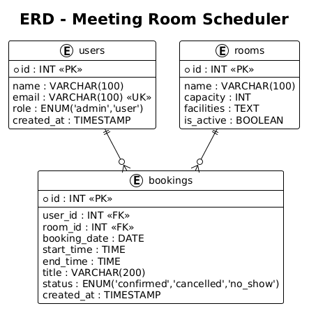
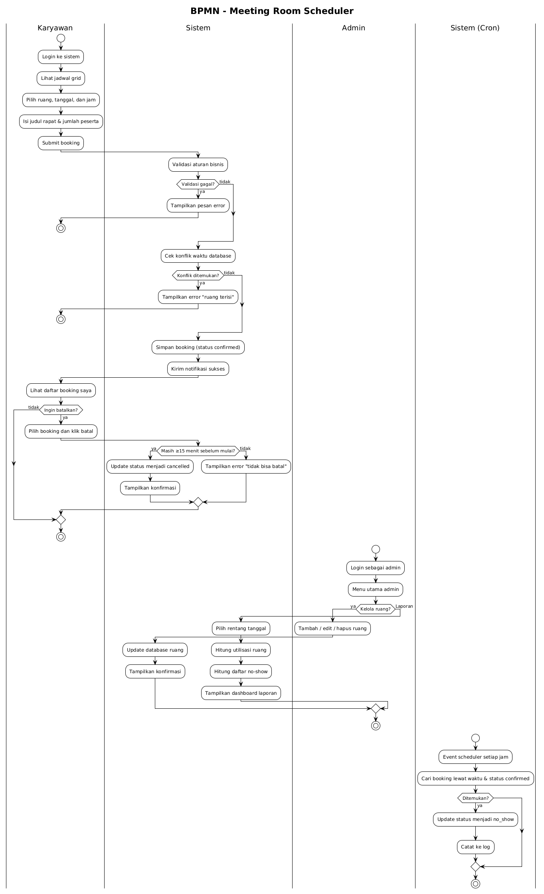

# meeting-room-scheduler
Documentation of Meeting Room Scheduler System Design

## Deskripsi Project

Meeting Room Scheduler adalah sistem berbasis web yang dirancang untuk memudahkan proses pemesanan ruang meeting secara terstruktur dan efisien. Sistem ini dibuat untuk mendokumentasikan rancangan sistem booking ruang meeting yang mencakup alur proses bisnis, struktur data, relasi antar entitas, serta interaksi antar komponen sistem.

Dokumentasi pada repository ini disusun sebagai bagian dari pengembangan sistem dan ditujukan untuk menjelaskan secara rinci perancangan aplikasi sebelum implementasi penuh dilakukan. Melalui dokumentasi ini, pengguna dapat memahami bagaimana sistem bekerja, bagaimana data disusun, serta bagaimana alur booking berlangsung dari awal hingga akhir.

## Tujuan Project

Tujuan utama dari project ini adalah untuk membangun rancangan sistem booking ruang meeting yang:
1. memudahkan pengguna dalam melakukan pemesanan ruang,
2. membantu admin dalam mengelola data ruang dan pemesanan,
3. mencegah terjadinya bentrokan jadwal,
4. menghasilkan dokumentasi sistem yang jelas dan mudah dipahami.

## Isi Repository

Repository ini berisi beberapa file diagram dan dokumentasi sistem, yaitu:

- `ERD.png`
- `BPMN.png`
- `Use Case Diagram.png`
- `Class Diagram.png`
- `Sequence Diagram.png`
- `README.md`

Setiap diagram memiliki fungsi yang berbeda dalam menjelaskan rancangan sistem booking ruang meeting.

---

## Deskripsi Setiap Diagram

### 1. ERD (Entity Relationship Diagram)


ERD digunakan untuk menggambarkan struktur basis data yang digunakan dalam sistem booking ruang meeting. Diagram ini menunjukkan entitas utama, atribut pada masing-masing entitas, serta hubungan antar entitas.

Pada sistem ini, ERD menjelaskan bagaimana data pengguna, data ruang meeting, dan data booking saling terhubung di dalam database. Dengan adanya ERD, rancangan database menjadi lebih terarah, konsisten, dan mudah dipahami sebelum implementasi ke MySQL dilakukan.

ERD juga membantu memastikan bahwa setiap data yang disimpan memiliki hubungan yang logis. Contohnya, satu pengguna dapat memiliki banyak data booking, dan satu ruang meeting juga dapat digunakan dalam banyak transaksi booking. Hubungan tersebut penting agar sistem dapat berjalan dengan baik dan tidak menimbulkan redundansi data yang berlebihan.

### 2. BPMN (Business Process Model and Notation)


BPMN digunakan untuk menjelaskan alur proses bisnis sistem secara keseluruhan. Diagram ini memperlihatkan tahapan kegiatan yang dilakukan oleh pengguna maupun admin dalam proses booking ruang meeting.

Melalui BPMN, dapat dipahami bagaimana alur sistem dimulai dari pengguna melihat ketersediaan ruang, memilih jadwal, mengajukan booking, hingga sistem melakukan validasi terhadap jadwal yang dipilih. Jika data yang dimasukkan sesuai, maka sistem akan menyimpan booking. Namun jika terjadi bentrok jadwal atau data tidak valid, sistem akan memberikan penolakan atau notifikasi kesalahan.

BPMN sangat penting karena menggambarkan logika operasional sistem sebelum masuk ke tahap implementasi. Dengan kata lain, BPMN membantu menjelaskan bagaimana proses bisnis berjalan secara nyata dan terstruktur.

### 3. Use Case Diagram


Use Case Diagram digunakan untuk menggambarkan interaksi antara aktor dan sistem. Diagram ini menunjukkan siapa saja pihak yang terlibat dalam penggunaan sistem dan fungsi apa saja yang dapat mereka akses.

Pada sistem booking ruang meeting, aktor yang biasanya terlibat adalah pengguna dan admin. Pengguna berperan untuk melihat ketersediaan ruang, melakukan booking, dan memantau status pemesanan. Sementara itu, admin memiliki wewenang untuk mengelola data ruang, memantau booking, dan memastikan sistem berjalan sesuai kebutuhan.

Use Case Diagram sangat membantu dalam memahami batasan sistem dan ruang lingkup fitur yang tersedia. Diagram ini juga menjadi dasar dalam menentukan hak akses masing-masing aktor.

### 4. Class Diagram


Class Diagram digunakan untuk menjelaskan struktur kelas atau objek yang ada di dalam sistem. Diagram ini memperlihatkan atribut, method, dan hubungan antar kelas yang digunakan dalam proses pengembangan aplikasi.

Class Diagram memberikan gambaran teknis mengenai bagaimana sistem akan dibangun di tingkat kode. Misalnya, class untuk pengguna, class untuk ruang meeting, dan class untuk booking dapat dibuat sesuai dengan kebutuhan sistem. Dengan adanya class diagram, pengembangan kode menjadi lebih terarah karena struktur objek sudah direncanakan sejak awal.

Diagram ini juga menunjukkan hubungan antar kelas, seperti asosiasi atau relasi yang mencerminkan bagaimana data saling berinteraksi di dalam aplikasi.

### 5. Sequence Diagram

Sequence Diagram digunakan untuk menjelaskan urutan interaksi antar objek atau komponen sistem dalam suatu proses tertentu. Diagram ini sangat berguna untuk memahami alur komunikasi yang terjadi ketika pengguna menjalankan sebuah fungsi di dalam sistem.

Pada sistem booking ruang meeting, sequence diagram dapat menggambarkan proses ketika pengguna melakukan booking. Alurnya dimulai dari pengguna mengirim permintaan, lalu sistem menerima data, memeriksa ketersediaan ruang, melakukan validasi, dan kemudian menyimpan hasil booking apabila semua syarat terpenuhi.

Diagram ini penting karena membantu menjelaskan bagaimana proses sistem berjalan secara berurutan dan logis. Dengan sequence diagram, alur kerja sistem menjadi lebih mudah dianalisis dan dipahami.

---

## Deskripsi Alur Sistem

Berikut adalah penjelasan umum mengenai alur kerja sistem booking ruang meeting:

### 1. Pengguna membuka sistem
Pengguna terlebih dahulu mengakses halaman utama sistem untuk melihat informasi ruang meeting yang tersedia. Pada tahap ini, sistem menampilkan data ruang dan jadwal yang dapat dipilih.

### 2. Pengguna memilih ruang dan jadwal
Setelah melihat ketersediaan ruang, pengguna menentukan ruang meeting yang ingin digunakan beserta tanggal dan jam pemakaian. Tahap ini merupakan inti dari proses booking.

### 3. Sistem melakukan validasi
Setelah data booking dikirim, sistem akan melakukan pengecekan terhadap jadwal yang dipilih. Validasi dilakukan untuk memastikan bahwa ruang belum terpakai pada waktu yang sama dan tidak terjadi bentrok dengan booking lain.

### 4. Data booking disimpan
Apabila hasil validasi menunjukkan bahwa jadwal masih tersedia, maka sistem akan menyimpan data booking ke dalam database. Booking yang berhasil biasanya diberi status tertentu agar dapat dipantau oleh admin maupun pengguna.

### 5. Admin memantau data booking
Admin memiliki peran untuk memantau seluruh aktivitas booking yang masuk. Selain itu, admin juga dapat mengelola data ruang meeting jika ada perubahan kapasitas, fasilitas, atau ketersediaan ruang.

### 6. Proses dokumentasi sistem
Seluruh alur di atas didokumentasikan melalui diagram yang telah disimpan dalam repository ini. Dokumentasi tersebut bertujuan agar pengembangan sistem dapat dipahami secara sistematis dan sesuai dengan kebutuhan akademik maupun profesional.

---

## Kesimpulan

```text
meeting-room-scheduler/
Berdasarkan hasil perancangan yang telah dilakukan, sistem Meeting Room Scheduler dirancang untuk membantu proses pemesanan ruang meeting secara lebih terstruktur, efisien, dan terdokumentasi dengan baik. Melalui pemanfaatan berbagai diagram perancangan seperti Entity Relationship Diagram (ERD), BPMN, Use Case Diagram, Class Diagram, dan Sequence Diagram, seluruh kebutuhan sistem dapat digambarkan secara jelas mulai dari proses bisnis, interaksi pengguna, hingga struktur data yang digunakan.

ERD menunjukkan hubungan antar entitas yang mendukung proses penyimpanan data secara terintegrasi. BPMN menggambarkan alur bisnis pemesanan ruang meeting dari awal hingga akhir. Use Case Diagram menjelaskan interaksi antara aktor dengan sistem, sedangkan Class Diagram dan Sequence Diagram memberikan gambaran mengenai struktur serta alur komunikasi antar komponen sistem selama proses booking berlangsung.

Dengan adanya dokumentasi ini, proses pengembangan sistem dapat dilakukan secara lebih terarah karena setiap kebutuhan dan mekanisme sistem telah dirancang terlebih dahulu. Selain itu, dokumentasi ini juga dapat digunakan sebagai referensi dalam tahap implementasi maupun pengembangan sistem di masa mendatang.

---
